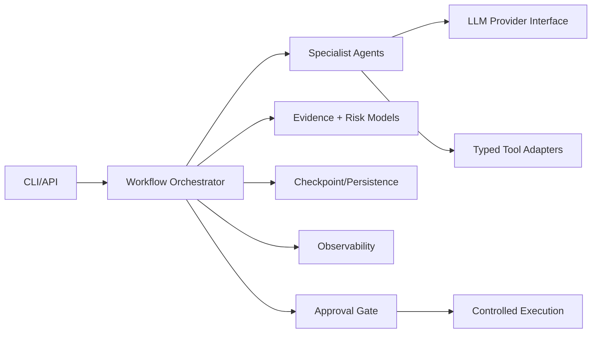

# Architecture

## Design goals

- Provider-neutral LLM layer
- Typed domain boundaries
- Explicit workflow state
- Tool isolation and least privilege
- Deterministic local mode
- Evidence-first results
- Human approval for production mutations
- Auditable execution

## Logical architecture

## Domain workflow

intake_and_normalize_requirements --> identify_constraints_and_nfrs --> generate_architecture_options --> evaluate_security_governance_reliability_cost --> challenge_options_with_critic --> score_and_rank_options --> produce_recommendation --> generate_adr_and_implementation_roadmap

See `SKILL.md` for the implementation roadmap.

## Phase 1 implementation

The CLI validates the YAML configuration and typed domain input before constructing the provider-neutral workflow. Every stage appends evidence to a strict `RunState` and checkpoints through `RunStateRepository`; the CLI uses atomic local JSON files under `out/state/`, while tests use an in-memory repository. A run ID can resume without replaying completed stages, and changed input is rejected.

Structured JSON events capture run, stage, agent, provider/model, latency, usage, retry, status, and error-category fields. Known secret-bearing fields are recursively redacted, and raw input payloads are not logged. Local run IDs are validated before becoming paths.

Phase 1 remains deterministic and read-only. Domain specialists, real tool adapters, and vendor providers begin in later phases; see ADR-0002.
